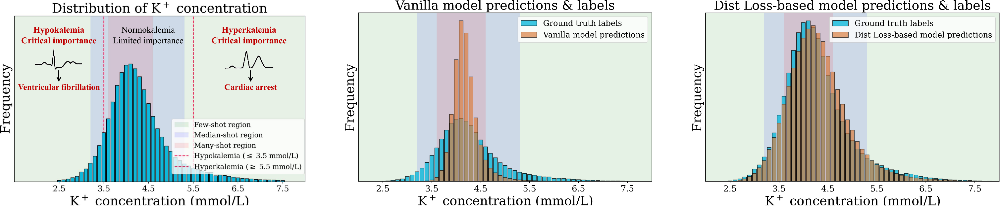

# Dist Loss: Enhancing Regression in Few-Shot Region through Distribution Distance Constraint

This repository contains the code for the paper:

[Dist Loss: Enhancing Regression in Few-Shot Region through Distribution Distance Constraint](https://openreview.net/pdf?id=YeSxbRrDRl)

Guangkun Nie, Gongzheng Tang, Shenda Hong

ICLR 2025

      
    A real-world healthcare task of potassium (K+) concentration regression from electrocardiogram (ECG).

## Quick review
'''python
print('Hello world')
'''
