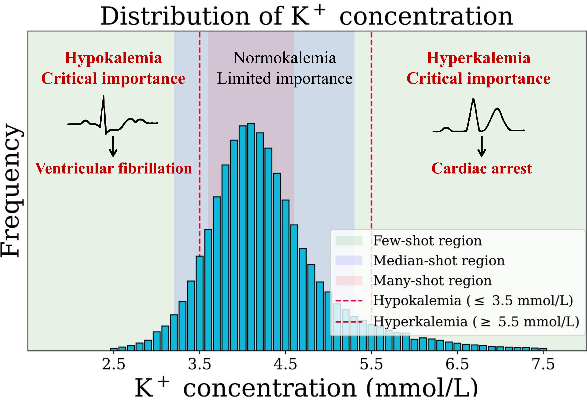
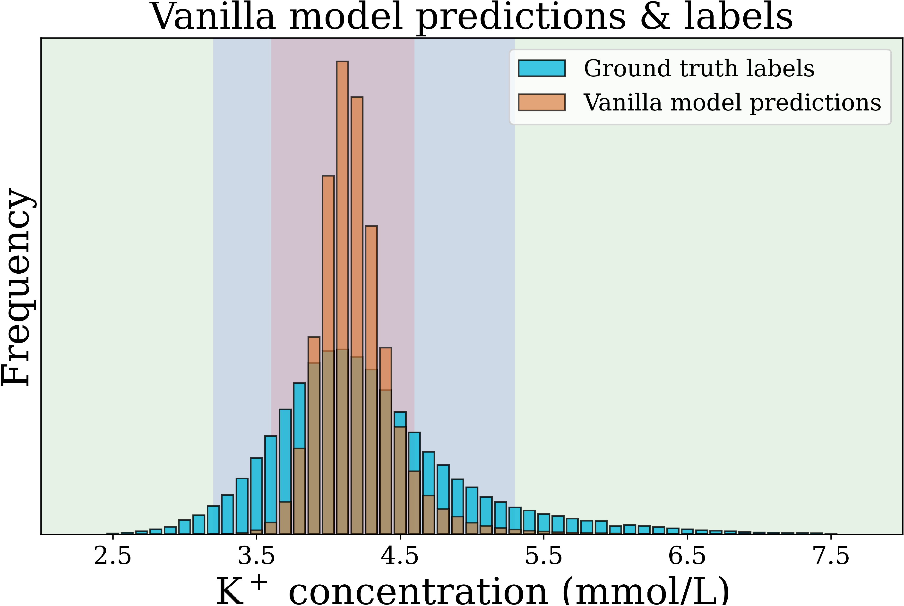
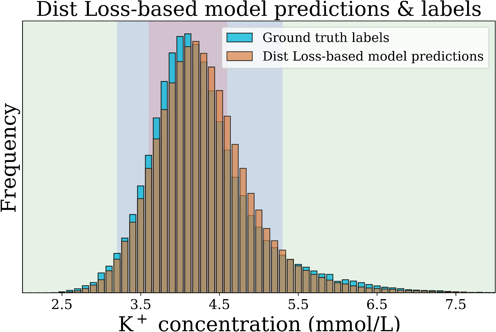

# Dist Loss: Enhancing Regression in Few-Shot Region through Distribution Distance Constraint

This repository contains the code for the paper:

[Dist Loss: Enhancing Regression in Few-Shot Region through Distribution Distance Constraint](https://openreview.net/pdf?id=YeSxbRrDRl)

Guangkun Nie, Gongzheng Tang, Shenda Hong

ICLR 2025

  

    
    
Figure 1: Description of Figure 1

  

  

    
    
Figure 2: Description of Figure 2

  

  

    
    
Figure 3: Description of Figure 3

  

